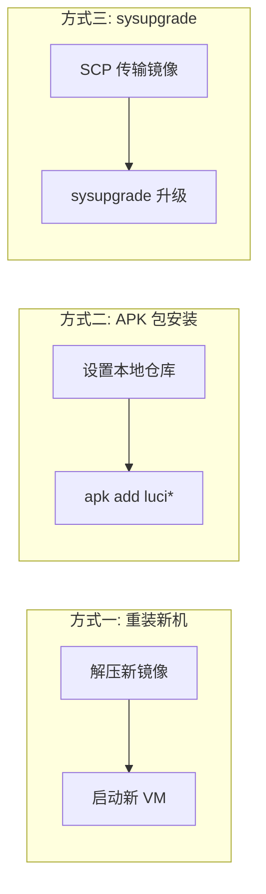

# OpenWrt x86 固件升级指南

## 环境信息

| 项目 | 值 |
|------|-----|
| 平台 | x86/64 Generic |
| 文件系统 | ext4 |
| 包管理器 | APK |
| 虚拟机 | QEMU/KVM, VNC 5900, IP 192.168.123.3 |

## 三种升级方式对比



| 方式 | 适用场景 | 保留配置 | 保留数据 |
|------|---------|---------|---------|
| 重装新机 | 全新部署 | ❌ | ❌ |
| APK 包安装 | 添加个别软件 | ✅ | ✅ |
| sysupgrade | 版本升级/批量变更 | ✅ | ✅ |

---

## 方式三：sysupgrade 升级（推荐）

### 前提条件

1. 新旧固件**版本一致**（同 revision、同内核 vermagic），否则需要操作系统版本升级
2. 目标机器有足够的 `/tmp` 空间存放镜像（至少 2x 镜像大小）
3. 编译机和目标机器网络互通

### 第一步：选择正确的镜像

**⚠️ 关键：必须使用 `combined` 镜像，不能使用 `rootfs` 镜像！**

| 镜像文件 | 是否可用 | 原因 |
|---------|---------|------|
| `ext4-rootfs.img.gz` | ❌ | 纯文件系统，无分区表元数据 |
| `ext4-combined.img.gz` | ✅ | 包含完整分区表 + 引导扇区 |
| `ext4-combined-efi.img.gz` | ✅ (EFI) | EFI 引导版本 |

`rootfs` 镜像会导致：
```
Image metadata not present
Invalid image type
```

### 第二步：SCP 传输镜像到 VM

将镜像通过 SCP 传输到虚拟机的 `/tmp` 目录：

```bash
scp /opt/project/openwrt/bin/targets/x86/64/openwrt-x86-64-generic-ext4-combined-efi.img.gz root@192.168.123.3:/tmp/sysupgrade.img.gz
```

> **为什么用 SCP 而不是 HTTP？** 编译机的后台进程（如 `python3 -m http.server`）在 MCP/SSH 会话间不稳定，SCP 传输更加可靠。

### 第三步：执行升级

```bash
ssh root@192.168.123.3 "sysupgrade -v -F /tmp/sysupgrade.img.gz"
```

> **Docker 持久化分区注意事项：** 不要添加 `-p` 参数。x86 平台默认保留现有分区表，额外的 `docker_data` 分区不会被普通 sysupgrade 写入；`-p` 会关闭该保留逻辑。完整配置与验证方法见 [docker-persistence.md](docker-persistence.md)。

参数说明：

| 参数 | 作用 |
|------|------|
| `-v` | 显示详细日志 |
| `-F` | 忽略镜像检查失败，强制执行 |
| `-c` | 保留 `/etc/` 下所有修改过的文件 |

### 第四步：等待重启并验证

升级过程会自动：
1. 下载镜像到 `/tmp/sysupgrade.img`
2. 备份配置文件到 `/tmp/sysupgrade.tgz`
3. 关闭所有会话 → 写入新系统 → **重启**

**对于 QEMU 虚拟机，如果使用了 `-no-reboot` 参数，重启后会关机，需手动重新启动：**

```bash
# 检查进程是否还在
ps aux | grep qemu | grep openwrt-old

# 如果已关机，重新启动
echo "Qw133133" | su -c "qemu-system-x86_64 \
  -name openwrt-old -machine q35 -smp 2 -m 512 \
  -drive file=/opt/project/openwrt/vm/openwrt-x86-64-generic-ext4-combined.img,format=raw,if=virtio \
  -netdev bridge,br=br0,id=net0 \
  -device virtio-net-pci,netdev=net0,mac=52:54:00:12:34:56 \
  -vnc :0 -daemonize -no-reboot -serial none -parallel none"
```

### 第五步：验证升级成功

```bash
# 等待系统启动
for i in $(seq 1 15); do
  ssh -o ConnectTimeout=3 root@192.168.123.3 "echo OK" 2>/dev/null && break
  sleep 3
done

# 检查版本
ssh root@192.168.123.3 "cat /etc/openwrt_release | head -3"

# 检查 LuCI 包
ssh root@192.168.123.3 "apk list --installed | grep -cE 'luci|uhttpd'"

# 检查 uhttpd 服务
ssh root@192.168.123.3 "/etc/init.d/uhttpd status"

# 检查 Web 端口
ssh root@192.168.123.3 "netstat -tlnp | grep ':80'"

# 检查 Docker 持久化分区（已配置时）
ssh root@192.168.123.3 "mount | grep ' on /opt/docker '"
ssh root@192.168.123.3 "docker ps -a"

# 访问 Web 界面
curl -s http://192.168.123.3/ | head -5
```

---

## 常见问题

### Q1: `Image metadata not present / Invalid image type`

**原因**：使用了 `rootfs.img.gz` 而不是 `combined.img.gz`。

**解决**：换成 `ext4-combined.img.gz`。

### Q2: `Failed to get "write" lock`

**原因**：有其他 QEMU 进程正在锁定该镜像文件。

**解决**：
```bash
# 查找占用进程
fuser /opt/project/openwrt/vm/openwrt-x86-64-generic-ext4-combined.img
# 强制终止
kill -9 <PID>
```

### Q3: 升级后虚拟机"消失"了

**原因**：QEMU 的 `-no-reboot` 导致升级后的重启变成了关机。

**解决**：手动重新启动 VM（见第四步）。

### Q4: bridge helper failed

**原因**：非 root 用户无权操作网桥。

**解决**：使用 `su -c` 以 root 运行 QEMU，或创建 `/etc/qemu/bridge.conf` 写入 `allow br0`。

### Q5: 升级后部分配置丢失

**原因**：默认只备份核心系统配置文件。

**解决**：使用 `-c` 参数保留所有 `/etc/` 修改：
```bash
ssh root@192.168.123.3 "sysupgrade -c -F /tmp/sysupgrade.img.gz"
```
